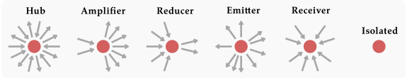

# Basic Influence Roles (BIRs) &middot; [](https://github.com/davidemiceli/basic-influence-roles/blob/master/LICENSE) [](https://github.com/davidemiceli/basic-influence-roles/pulls)

_**A deterministic scalable algorithm to detect and measure the basic influence role each node plays within a directed network.**_

Every node plays a certain role in the network and affects the other nodes in its own different way.
Given a large dataset of nodes as input, the algorithm provides a ranking of all nodes by influence score, reporting their typology of influence, their sublevels,
and their influence measures related to the role.

The algorithm is implemented in the following programming languages:
- [**Python**](https://github.com/davidemiceli/basic-influence-roles/tree/main/python)

## Roles

<p align="center">
  
</p>

Role | Description | Levels
--- | --- | --- |
Emitter | A node that spreads information without receiving. | *branch, weak, strong, top*
Amplifier | A node with significantly more outgoing connections than incoming ones. | *weak, strong, top*
Hub | A node balanced as production and reception of information. | *branch, weak, strong, top*
Reducer | A node with significantly more incoming connections than outcoming ones | *weak, strong, top*
Receiver | A node which receives only interactions, but does not produce any. | *branch, weak, strong, top*
Isolated | A totally non-participatory (or totally disconnected) node | *none*

## Levels of role

<p align="center">
  
</p>

Role | Description
--- | --- |
None | A total absence of influence.
Branch | The lowest influence related to a given role.
Weak | A weak role influence.
Strong | A strong role influence.
Top | The greatest influence related to a given role.

## Influence measure

Influence measure is a normalized value to quantify the influence magnitude of every role.

## Citing

If you use this software in your work, please cite it as below:
```
Miceli, D. (2024). Basic Influence Roles (BIRs) (Version 1.0.0) [Computer software]. https://github.com/davidemiceli/basic-influence-roles
```

Or the BibTeX version:

```bibtex
@software{Miceli_Basic_Influence_Roles_2024,
author = {Miceli, Davide},
license = {MIT},
month = mar,
title = {{Basic Influence Roles (BIRs)}},
url = {https://github.com/davidemiceli/basic-influence-roles},
version = {1.0.0},
year = {2024}
}
```

## License

Basic Influence Roles is an open source project available under the [MIT license](https://github.com/davidemiceli/basic-influence-roles/blob/main/LICENSE).
